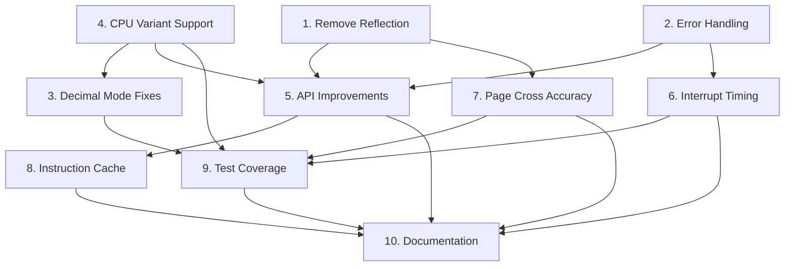

# Implementation Roadmap

This document provides an overview of all planned improvements to the sixty502 codebase, organized by priority and dependencies.

## Overview

The improvements are organized into three priority levels:

- **High Priority**: Critical for performance, accuracy, and API quality
- **Medium Priority**: Important for completeness and usability
- **Low Priority**: Nice-to-have enhancements

## High Priority Improvements

### 1. Remove Reflection from Hot Paths

**File**: [`01-high-priority-reflection-removal.md`](01-high-priority-reflection-removal.md)

**Impact**: ~50% performance improvement in instruction execution

**Effort**: Medium (2-3 days)

**Dependencies**: None

**Summary**: Replace reflection-based addressing mode comparisons with enum-based approach. Eliminates ~256 reflection calls per instruction.

**Key Changes**:

- Add `AddrModeType` enum
- Update `Instruction` struct with `AddrModeType` field
- Replace all `getFuncPtr()` calls with enum comparisons
- Remove `reflect` import

---

### 2. Add Error Handling to Clock()

**File**: [`02-high-priority-error-handling.md`](02-high-priority-error-handling.md)

**Impact**: Better error detection and debugging

**Effort**: Medium (2-3 days)

**Dependencies**: None

**Summary**: Add error returns to `Clock()` method with configurable error handling strategies.

**Key Changes**:

- Define `CPUError` type
- Add `ErrorHandler` interface
- Update `Clock()` to return errors
- Provide strict, logging, and ignore error handlers

---

### 3. Fix Decimal Mode Edge Cases

**File**: [`03-high-priority-decimal-mode-fixes.md`](03-high-priority-decimal-mode-fixes.md)

**Impact**: Correct BCD arithmetic behavior

**Effort**: Medium (2-3 days)

**Dependencies**: #4 (CPU Variant Support)

**Summary**: Fix carry/borrow detection in ADC/SBC decimal mode and add comprehensive tests.

**Key Changes**:

- Fix lower nibble carry detection in `ADC()`
- Fix lower nibble borrow detection in `SBC()`
- Use +10 adjustment instead of +6 for BCD
- Add variant-specific N/V flag behavior

---

### 4. Add CPU Variant Support

**File**: [`04-high-priority-cpu-variant-support.md`](04-high-priority-cpu-variant-support.md)

**Impact**: Accurate emulation for different systems

**Effort**: Medium (2-3 days)

**Dependencies**: None (but enhances #3)

**Summary**: Support NMOS 6502, CMOS 65C02, and Ricoh 2A03 variants with different behaviors.

**Key Changes**:

- Add `CPUVariant` type
- Add variant-specific methods
- Update `IND()` for variant-specific JMP bug
- Update `ADC()`/`SBC()` for variant-specific decimal mode

---

## Medium Priority Improvements

### 5. API Improvements

**File**: [`05-medium-priority-api-improvements.md`](05-medium-priority-api-improvements.md)

**Impact**: Better encapsulation and usability

**Effort**: Medium (2-3 days)

**Dependencies**: #1, #2, #4

**Summary**: Make internal fields private, add configuration options, and provide builder pattern.

**Key Changes**:

- Make `Cycles`, `lookup`, `totalCycles` private
- Add accessor methods
- Create `CPUConfig` struct
- Implement builder pattern
- Add state snapshot functionality

---

### 6. Improve Interrupt Timing

**File**: [`06-medium-priority-interrupt-timing.md`](06-medium-priority-interrupt-timing.md)

**Impact**: Accurate interrupt behavior

**Effort**: Medium (2-3 days)

**Dependencies**: #2 (Error Handling)

**Summary**: Implement proper interrupt polling, edge detection, and timing.

**Key Changes**:

- Add interrupt state fields
- Implement `SetIRQ()` and `SetNMI()` methods
- Add interrupt polling in `Clock()`
- Implement NMI edge detection
- Support NMI hijacking of IRQ

---

### 7. Page Cross Cycle Accuracy

**File**: [`07-medium-priority-page-cross-accuracy.md`](07-medium-priority-page-cross-accuracy.md)

**Impact**: Accurate cycle timing

**Effort**: Small (1 day)

**Dependencies**: #1 (Reflection Removal)

**Summary**: Add instruction-specific page cross penalty behavior.

**Key Changes**:

- Add `PageCrossPenalty` field to `Instruction`
- Update `Clock()` to respect penalty flag
- Update all 256 opcodes with correct penalty
- Document page cross behavior

---

## Low Priority Improvements

### 8. Add Instruction Cache

**File**: [`08-low-priority-instruction-cache.md`](08-low-priority-instruction-cache.md)

**Impact**: 5-15% performance improvement

**Effort**: Small (1-2 days)

**Dependencies**: #5 (API Improvements)

**Summary**: Cache recently executed instructions to reduce lookup overhead.

**Key Changes**:

- Add `InstructionCache` struct
- Integrate cache into `Clock()`
- Add cache control methods
- Add cache statistics

---

### 9. Expand Test Coverage

**File**: [`09-low-priority-test-coverage.md`](09-low-priority-test-coverage.md)

**Impact**: Higher confidence in correctness

**Effort**: Large (5-7 days)

**Dependencies**: #3, #4, #6, #7

**Summary**: Add comprehensive tests for all gaps identified in analysis.

**Key Changes**:

- Add simultaneous interrupt tests
- Add all decimal mode edge cases
- Add instruction length validation
- Add unofficial opcode tests
- Add self-modifying code tests
- Add cycle accuracy tests
- Integrate Klaus Dormann test suite

---

### 10. Improve Documentation

**File**: [`10-low-priority-documentation.md`](10-low-priority-documentation.md)

**Impact**: Better developer experience

**Effort**: Medium (3-4 days)

**Dependencies**: All others (documents final API)

**Summary**: Add comprehensive documentation at all levels.

**Key Changes**:

- Add godoc comments to all exports
- Document complex algorithms
- Create Architecture Decision Records
- Expand README with examples
- Create performance guide
- Create troubleshooting guide
- Add compatibility matrix

---

## Implementation Order

### Phase 1: Foundation (High Priority)

**Duration**: 2-3 weeks

1. **Week 1**:
   - #1: Remove Reflection (3 days)
   - #2: Add Error Handling (2 days)

2. **Week 2**:
   - #4: CPU Variant Support (3 days)
   - #3: Fix Decimal Mode (2 days)

**Deliverable**: Core improvements with significant performance gains and accuracy fixes

---

### Phase 2: Enhancement (Medium Priority)

**Duration**: 2 weeks

3. **Week 3**:
   - #5: API Improvements (3 days)
   - #7: Page Cross Accuracy (1 day)

4. **Week 4**:
   - #6: Interrupt Timing (3 days)

**Deliverable**: Polished API with accurate timing

---

### Phase 3: Polish (Low Priority)

**Duration**: 2-3 weeks

5. **Week 5**:
   - #8: Instruction Cache (2 days)
   - Start #9: Test Coverage (3 days)

6. **Week 6-7**:
   - Continue #9: Test Coverage (4 days)
   - #10: Documentation (3 days)

**Deliverable**: Production-ready library with comprehensive tests and documentation

---

## Dependency Graph

## Testing Strategy

Each phase includes:

1. **Unit Tests**: Test individual components
2. **Integration Tests**: Test component interactions
3. **Regression Tests**: Ensure no existing functionality breaks
4. **Benchmark Tests**: Verify performance improvements

## Success Metrics

### Phase 1 Success Criteria

- [ ] 50% performance improvement (reflection removal)
- [ ] Error handling working in all modes
- [ ] All CPU variants supported
- [ ] Decimal mode passes all edge case tests
- [ ] All existing tests pass

### Phase 2 Success Criteria

- [ ] Internal fields properly encapsulated
- [ ] Configuration system working
- [ ] Interrupt timing accurate
- [ ] Page cross cycles correct for all instructions
- [ ] All existing tests pass

### Phase 3 Success Criteria

- [ ] Instruction cache showing 5-15% improvement
- [ ] Test coverage >95%
- [ ] All documentation complete
- [ ] Klaus Dormann test suite passing
- [ ] All benchmarks improved or stable

## Risk Assessment

### High Risk Items

- **Reflection Removal**: Could introduce subtle bugs if enum assignments incorrect
  - *Mitigation*: Comprehensive validation tests
  
- **Decimal Mode Fixes**: Complex algorithm changes
  - *Mitigation*: Extensive edge case testing

### Medium Risk Items

- **API Changes**: Breaking changes to public API
  - *Mitigation*: Maintain backward compatibility, provide migration guide

- **Interrupt Timing**: Complex state management
  - *Mitigation*: Thorough interrupt tests

### Low Risk Items

- **Documentation**: No code changes
- **Test Coverage**: Additive only

## Rollback Plan

Each improvement should be:

1. Implemented in a feature branch
2. Fully tested before merge
3. Benchmarked to verify improvements
4. Documented with migration notes if breaking

If an improvement causes issues:

1. Revert the specific commit
2. Analyze the failure
3. Fix and re-test
4. Re-apply when stable

## Communication Plan

### For Each Phase

1. **Start**: Announce phase start, expected duration
2. **Progress**: Weekly updates on completed items
3. **Complete**: Summary of changes, performance metrics, migration notes

### Documentation Updates

- Update README.md with new features
- Update CHANGELOG.md with all changes
- Create migration guides for breaking changes

## Next Steps

1. Review this roadmap with stakeholders
2. Prioritize any additional requirements
3. Begin Phase 1, Item #1 (Reflection Removal)
4. Set up CI/CD for automated testing and benchmarking
