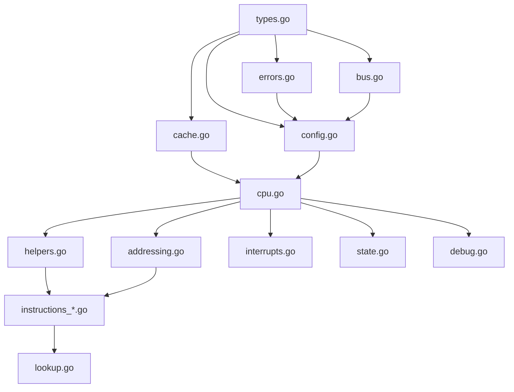

# Modularization Plan Summary

## Quick Reference

### Proposed File Structure

```text
cpu6502/
├── cpu.go                         # Core CPU struct and execution (~300 lines)
├── types.go                       # Type definitions (~150 lines)
├── errors.go                      # Error handling (~100 lines)
├── bus.go                         # Bus interface (~30 lines)
├── config.go                      # Configuration & builders (~200 lines)
├── cache.go                       # Instruction cache (~100 lines)
├── addressing.go                  # Addressing modes (~150 lines)
├── helpers.go                     # Shared helpers (~50 lines)
├── instructions_arithmetic.go     # ADC, SBC, INC, DEC, CMP (~200 lines)
├── instructions_logical.go        # AND, ORA, EOR, BIT (~100 lines)
├── instructions_shift.go          # ASL, LSR, ROL, ROR (~150 lines)
├── instructions_branch.go         # Branch instructions (~80 lines)
├── instructions_transfer.go       # Load/Store/Transfer (~120 lines)
├── instructions_stack.go          # Stack operations (~60 lines)
├── instructions_control.go        # JMP, JSR, RTS, RTI, BRK (~100 lines)
├── instructions_flags.go          # Flag manipulation (~50 lines)
├── lookup.go                      # Instruction lookup table (~350 lines)
├── interrupts.go                  # IRQ/NMI handling (~150 lines)
├── state.go                       # State inspection (~150 lines)
└── debug.go                       # Disassembly & debug (~200 lines)
```

### Module Dependencies



## Key Benefits

### 1. Maintainability

- **Before**: 2,129 lines in one file
- **After**: 20 files, largest ~350 lines
- **Improvement**: 85% reduction in file size

### 2. Organization

- **Before**: All code mixed together
- **After**: Clear logical grouping
- **Improvement**: Easy to find specific functionality

### 3. Testability

- **Before**: Tests must understand entire file
- **After**: Tests can focus on specific modules
- **Improvement**: Better test isolation

### 4. Development

- **Before**: Merge conflicts common
- **After**: Parallel development easier
- **Improvement**: Reduced conflicts

## Implementation Phases

### Phase 1: Foundation (2 hours)

- types.go
- errors.go
- bus.go

### Phase 2: Configuration (1 hour)

- config.go

### Phase 3: Support (1 hour)

- cache.go
- helpers.go

### Phase 4: Addressing (1 hour)

- addressing.go

### Phase 5: Instructions (4 hours)

- All instruction modules
- Largest and most complex phase

### Phase 6: Lookup (1 hour)

- lookup.go

### Phase 7: Interrupts (1 hour)

- interrupts.go

### Phase 8: State & Debug (1.5 hours)

- state.go
- debug.go

### Phase 9: CPU Core (1 hour)

- Refactor cpu.go

### Phase 10: Validation (1.5 hours)

- Testing and documentation

**Total Estimated Time**: 14.5-18 hours

## Backward Compatibility

### ✅ No Breaking Changes

- All public APIs remain unchanged
- All types stay in same package
- All methods have same signatures
- Existing code continues to work

### ✅ Same Package

- All files in `package cpu6502`
- No import changes needed
- Internal organization only

### ✅ Same Behavior

- No logic changes
- Same cycle accuracy
- Same instruction behavior
- Same error handling

## Testing Strategy

### After Each Module

```bash
go build                    # Verify compilation
go test -v ./...           # Run all tests
go test -race ./...        # Check for races
```

### Final Validation

```bash
go test -v ./...           # All tests pass
go test -race ./...        # No race conditions
go test -bench=.           # No performance regression
cd examples/basic && go run main.go
cd examples/memory-mapped && go run main.go
```

## Risk Mitigation

### Low Risk

- Incremental approach
- Continuous testing
- Same package (no import issues)
- No API changes

### Mitigation Strategies

1. Work one module at a time
2. Test after each extraction
3. Commit frequently
4. Document dependencies
5. Use git for safety

## Success Criteria

- [x] Planning documentation complete
- [ ] All tests pass
- [ ] No breaking changes
- [ ] Each file < 400 lines
- [ ] Clear organization
- [ ] Documentation updated
- [ ] Examples work

## Documentation Deliverables

1. ✅ **00-overview.md** - Executive summary and plan overview
2. ✅ **01-types-module.md** - Type definitions module plan
3. ✅ **02-errors-module.md** - Error handling module plan
4. ✅ **03-instructions-module.md** - Instruction modules plan
5. ✅ **04-remaining-modules.md** - All other modules plan
6. ✅ **05-implementation-guide.md** - Step-by-step implementation
7. ✅ **06-summary.md** - This summary document

## Next Steps

### 1. Review Planning Documents

- Read through all planning docs
- Verify approach makes sense
- Identify any concerns

### 2. Get Approval

- Review with team/stakeholders
- Address any questions
- Get go-ahead for implementation

### 3. Begin Implementation

- Follow implementation guide
- Work through phases sequentially
- Test continuously

### 4. Complete and Validate

- Finish all phases
- Run comprehensive tests
- Update documentation

## Questions & Answers

### Q: Will this break existing code?

**A**: No. All public APIs remain unchanged. This is purely internal reorganization.

### Q: How long will this take?

**A**: Estimated 14.5-18 hours of focused work, can be done over several days.

### Q: Can we do this incrementally?

**A**: Yes. Each phase can be completed and tested independently.

### Q: What if we find issues?

**A**: Git allows easy rollback. Each phase is committed separately.

### Q: Will performance be affected?

**A**: No. Same code, just different files. No runtime impact.

### Q: Do tests need to change?

**A**: No. Tests remain in same package, all references work unchanged.

### Q: Can we add more modules later?

**A**: Yes. This structure makes it easy to add new modules as needed.

### Q: What about documentation?

**A**: Each module will have focused documentation. Overall docs will be updated.

## Conclusion

This modularization plan provides a clear path to transform the monolithic `cpu.go` file into a well-organized, maintainable codebase. The approach is:

- **Safe**: No breaking changes, continuous testing
- **Incremental**: One module at a time
- **Reversible**: Git provides safety net
- **Beneficial**: Improved maintainability, testability, and development experience

The planning phase is complete. Ready to proceed with implementation upon approval.

---

**Status**: Planning Complete ✅  
**Next**: Await approval to begin implementation  
**Branch**: `feat/split-modules`  
**Estimated Effort**: 14.5-18 hours
